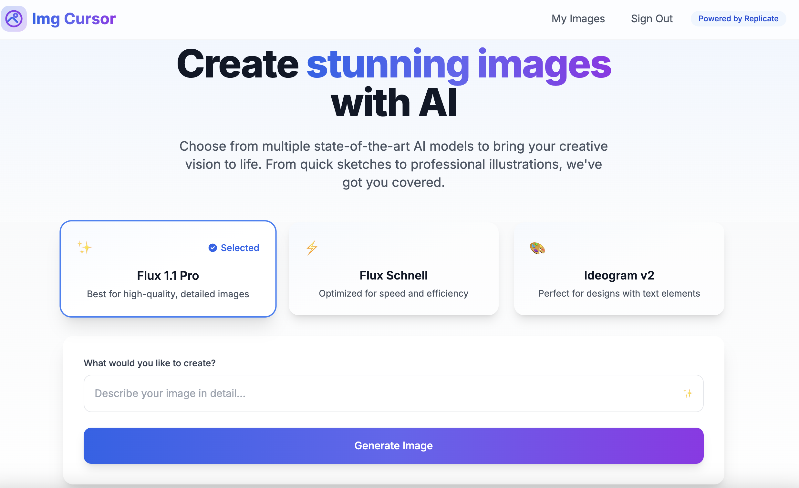
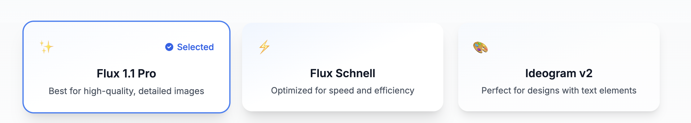

# AI Image Generator

A modern web application for generating AI-powered images using multiple state-of-the-art models. Built with Next.js 14, Firebase, and Replicate API.

## Screenshots

### Home Page & Image Generation

*The main interface where users can select models and generate images*

### Image Gallery

*Personal gallery showing all generated images with metadata*

### Model Selection

*Choose from multiple AI models with different capabilities*

## Features

- 🎨 Multiple AI Models:
  - **Flux Pro**: High-quality, detailed image generation
  - **Flux Schnell**: Fast, efficient image generation
  - **Ideogram**: Specialized in illustrations and text rendering

- 🔐 Authentication:
  - Google Sign-in integration
  - Protected routes and features

- 💾 Image Management:
  - Automatic saving of generated images
  - Personal image gallery
  - Image metadata tracking

- 🎯 User Experience:
  - Responsive design
  - Real-time generation status
  - Detailed model information
  - Generation parameters customization

## Setup

1. Clone the repository:
```bash
git clone https://github.com/popand/multimodelimagegenerator.git
cd multimodelimagegenerator
```

2. Install dependencies:
```bash
npm install
```

3. Create a `.env.local` file with your API keys:
```env
# Firebase Configuration
NEXT_PUBLIC_FIREBASE_API_KEY=your_api_key
NEXT_PUBLIC_FIREBASE_AUTH_DOMAIN=your_auth_domain
NEXT_PUBLIC_FIREBASE_PROJECT_ID=your_project_id
NEXT_PUBLIC_FIREBASE_STORAGE_BUCKET=your_storage_bucket
NEXT_PUBLIC_FIREBASE_MESSAGING_SENDER_ID=your_sender_id
NEXT_PUBLIC_FIREBASE_APP_ID=your_app_id

# Replicate API Token
REPLICATE_API_TOKEN=your_replicate_token
```

4. Start the development server:
```bash
npm run dev
```

## Technologies Used

- **Frontend**: Next.js 14, React, Tailwind CSS
- **Authentication**: Firebase Auth
- **Storage**: Firebase Storage & Firestore
- **AI Models**: Replicate API
  - black-forest-labs/flux-1.1-pro
  - black-forest-labs/flux-schnell
  - ideogram-ai/ideogram-v2

## Project Structure

```
src/
├── app/
│   ├── api/            # API routes
│   ├── components/     # React components
│   ├── my-images/      # Image gallery page
│   └── page.tsx        # Home page
├── lib/
│   ├── contexts/       # React contexts
│   ├── firebase/       # Firebase configuration
│   └── hooks/          # Custom hooks
```

## License

This project is licensed under the MIT License - see the [LICENSE](LICENSE) file for details.
